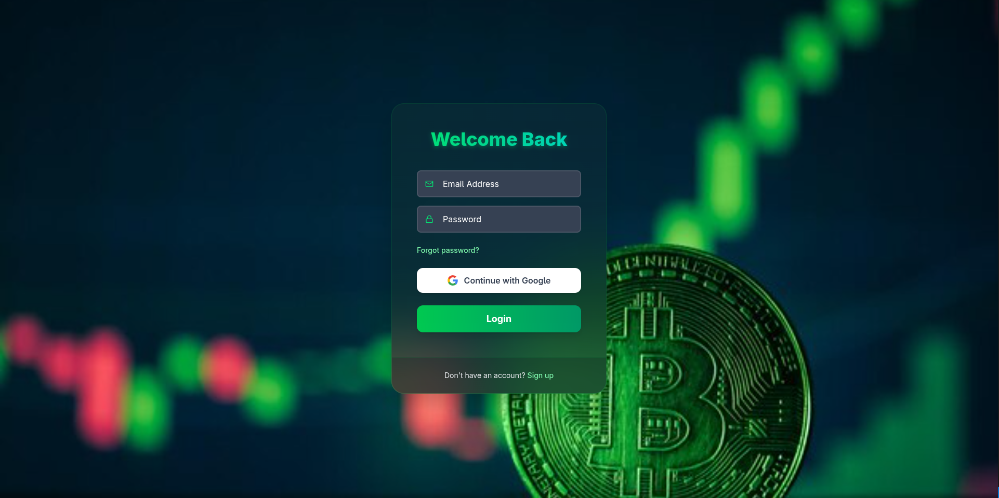
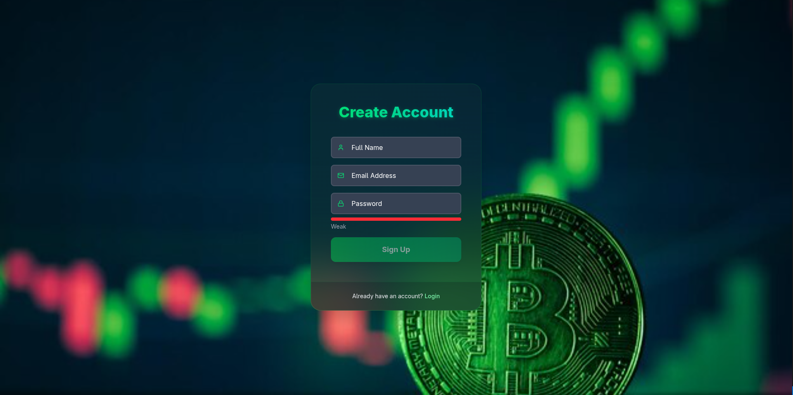
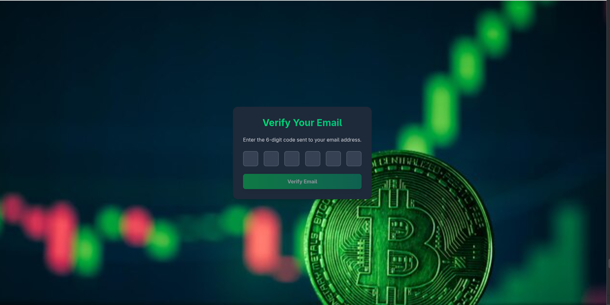
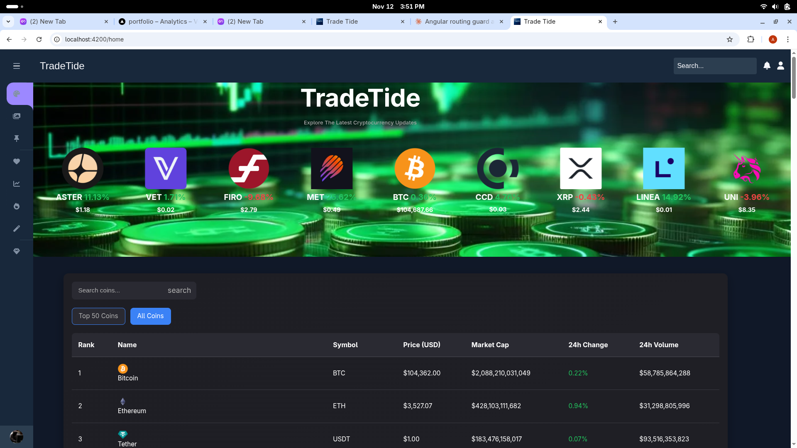
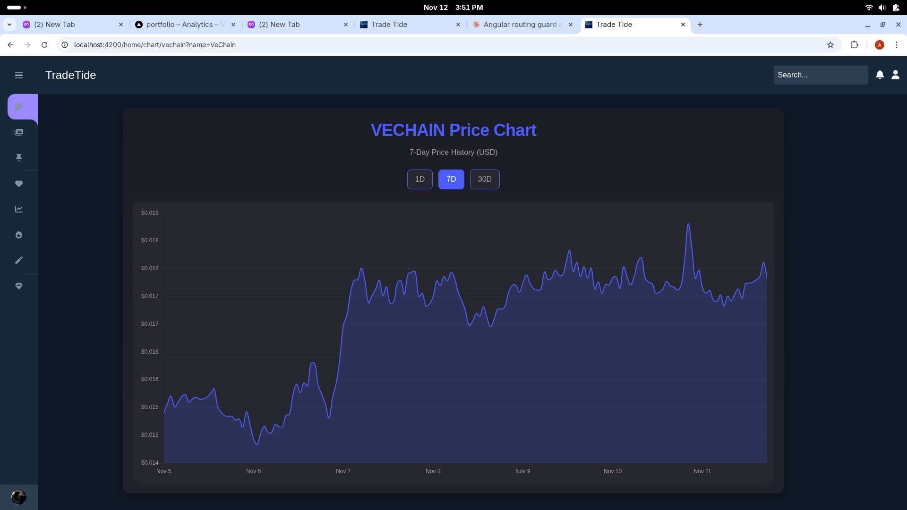
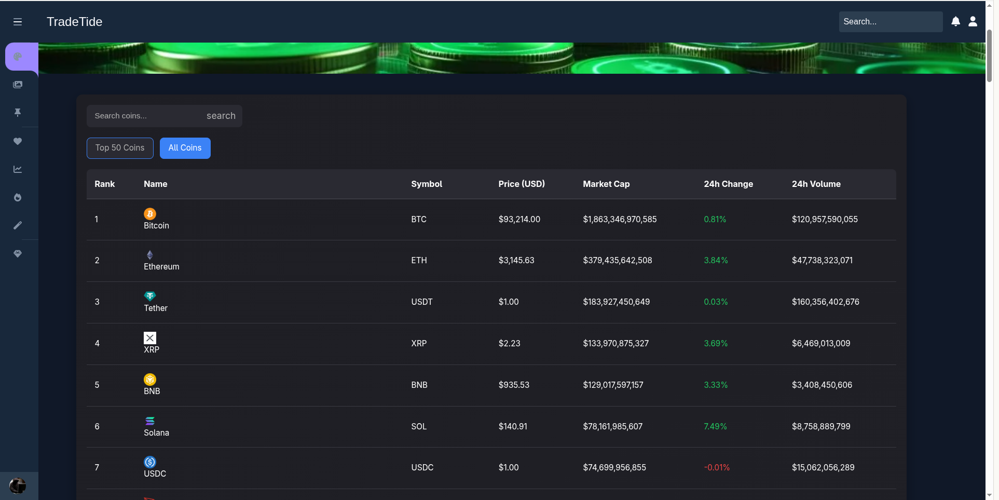
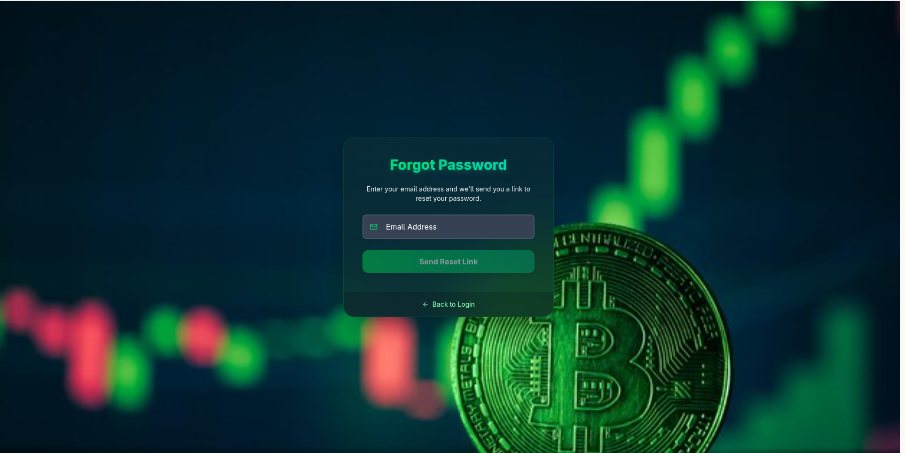

# 🚀 TradeTide - Real-Time Cryptocurrency Trading Platform

<div align="center">


[](https://spring.io/projects/spring-boot)
[](https://angular.io/)
[](https://jwt.io/)
[](LICENSE)

**A full-stack cryptocurrency trading platform with real-time market data and secure authentication**

[Features](#-features) • [Architecture](#-architecture) • [Tech Stack](#-tech-stack) • [Getting Started](#-getting-started) • [API Documentation](#-api-documentation)

</div>

---

## 📊 Project Overview

TradeTide is a **full-stack cryptocurrency trading platform** that provides real-time market data, advanced charting capabilities, and secure user authentication. Built with Spring Boot and Angular, it integrates with CoinGecko API to deliver live cryptocurrency prices and market information.

### 🎯 Key Features

- ⚡ **Optimized performance** with efficient database queries and caching
- 🔒 **Secure authentication** with JWT and 2FA email verification
- 📈 **Real-time market data** integration with CoinGecko API
- 🎨 **Modern, responsive UI** built with Angular 20 and Tailwind CSS
- 📧 **Email verification system** with OTP-based authentication

---

## ✨ Features

### 🔐 Authentication & Security
- **JWT-based Authentication**
  - Stateless token-based authentication
  - Secure password encryption with BCrypt
  - Email verification with OTP
  - Two-Factor Authentication (2FA) support
  - Password reset functionality
  - Password strength validation

### 💹 Trading Features
- **Real-time Market Data**
  - Live cryptocurrency prices from CoinGecko API
  - Top 50 coins by market cap
  - Trending coins discovery
  - Advanced search functionality
  - 24h price changes and volume tracking

### 📊 Data Visualization
- **Interactive Charts**
  - Price history visualization with Chart.js
  - Multiple timeframe views (1D, 7D, 30D)
  - Responsive chart components
  - Market cap and volume tracking

### 👤 User Management
- **Profile System**
  - User registration and login
  - Email verification workflow
  - Password strength validation
  - Profile management
  - Two-factor authentication toggle

---

## 🏗️ Architecture

### System Architecture

```
┌─────────────────────────────────────────────────────────────┐
│                        Client Layer                          │
│  ┌──────────────┐  ┌──────────────┐  ┌──────────────┐      │
│  │  Angular 20  │  │  TypeScript  │  │  Tailwind    │      │
│  └──────────────┘  └──────────────┘  └──────────────┘      │
└─────────────────────────────────────────────────────────────┘
                              │
                              ▼
┌─────────────────────────────────────────────────────────────┐
│                     REST API Layer                           │
│  ┌──────────────────────────────────────────────────────┐   │
│  │  Spring Boot REST API (Port 8080)                    │   │
│  │  - JWT Authentication Filter                         │   │
│  │  - CORS Configuration                                │   │
│  │  - Exception Handling                                │   │
│  └──────────────────────────────────────────────────────┘   │
└─────────────────────────────────────────────────────────────┘
                              │
                              ▼
┌─────────────────────────────────────────────────────────────┐
│                    Service Layer                             │
│  ┌──────────────┐  ┌──────────────┐  ┌──────────────┐      │
│  │    Auth      │  │    Coin      │  │    User      │      │
│  │   Service    │  │   Service    │  │   Service    │      │
│  └──────────────┘  └──────────────┘  └──────────────┘      │
│  ┌──────────────┐  ┌──────────────┐  ┌──────────────┐      │
│  │    2FA       │  │ Verification │  │    Email     │      │
│  │   Service    │  │   Service    │  │   Service    │      │
│  └──────────────┘  └──────────────┘  └──────────────┘      │
└─────────────────────────────────────────────────────────────┘
                              │
                              ▼
┌─────────────────────────────────────────────────────────────┐
│                     Data Access Layer                        │
│  ┌──────────────┐  ┌──────────────┐  ┌──────────────┐      │
│  │  User Repo   │  │  2FA Repo    │  │ Verification │      │
│  └──────────────┘  └──────────────┘  │     Repo     │      │
│                                       └──────────────┘      │
└─────────────────────────────────────────────────────────────┘
                              │
                              ▼
┌─────────────────────────────────────────────────────────────┐
│                    External Services                         │
│  ┌──────────────┐  ┌──────────────┐  ┌──────────────┐      │
│  │   MongoDB    │  │  CoinGecko   │  │  JavaMail    │      │
│  │   Database   │  │     API      │  │   (SMTP)     │      │
│  └──────────────┘  └──────────────┘  └──────────────┘      │
└─────────────────────────────────────────────────────────────┘
```

### Design Patterns
- **Repository Pattern** for data access abstraction
- **Service Layer Pattern** for business logic separation
- **DTO Pattern** for data transfer
- **Builder Pattern** for JWT token generation
- **Guard Pattern** for Angular route protection

---

## 🛠️ Tech Stack

### Backend
| Technology | Purpose | Version |
|------------|---------|---------|
|  | Core Language | 17+ |
|  | Framework | 3.x |
|  | Authentication | 6.x |
|  | Token Auth | 0.11.x |
|  | Database | 6.x |
|  | Email Service | Latest |

### Frontend
| Technology | Purpose |
|------------|---------|
|  | Frontend Framework |
|  | Type Safety |
|  | Styling |
|  | Utility-First CSS |
|  | Reactive Programming |
|  | Data Visualization |

### DevOps & Tools
| Technology | Purpose |
|------------|---------|
|  | Version Control |
|  | API Testing |
|  | Build Tool |

---

## 🚀 Getting Started

### Prerequisites

```bash
- Java 17 or higher
- Node.js 18+ and npm
- MongoDB 6.x
- Maven 3.8+
- Angular CLI 20+
```

### Backend Setup

```bash
# Clone the repository
git clone https://github.com/ayhemnouira/TradeTide.git
cd tradetide/backend

# Configure application.properties
# Update the following in src/main/resources/application.properties:
# spring.data.mongodb.uri=mongodb://localhost:27017/tradetide
# spring.mail.username=your-email@gmail.com
# spring.mail.password=your-app-specific-password
# jwt.secret=your-secret-key

# Build the project
mvn clean install

# Run the application
mvn spring-boot:run
```

The backend server will start on `http://localhost:8080`

### Frontend Setup

```bash
cd tradetide/frontend

# Install dependencies
npm install

# Start development server
ng serve
```

The frontend application will start on `http://localhost:4200`

### Email Configuration

For email verification to work, configure Gmail SMTP:

1. Enable 2-Step Verification in your Google Account
2. Generate an App Password: Google Account → Security → App passwords
3. Use the app password in `application.properties`:

```properties
spring.mail.host=smtp.gmail.com
spring.mail.port=587
spring.mail.username=your-email@gmail.com
spring.mail.password=your-16-digit-app-password
spring.mail.properties.mail.smtp.auth=true
spring.mail.properties.mail.smtp.starttls.enable=true
```

---

## 📡 API Documentation

### Authentication Endpoints

#### Register User
```http
POST /register
Content-Type: application/json

{
  "fullName": "John Doe",
  "email": "john@example.com",
  "password": "SecurePass123!"
}
```

**Response:** `200 OK` with user details

#### Login
```http
POST /login
Content-Type: application/json

{
  "email": "john@example.com",
  "password": "SecurePass123!"
}
```

**Response:** Session ID for 2FA verification

#### Verify 2FA OTP
```http
POST /two-factor/otp/{otp}?id={sessionId}
```

**Response:** JWT token in `Authorization` header

### User Management Endpoints

#### Get User Profile
```http
GET /api/users/profile
Authorization: Bearer {jwt_token}
```

#### Send Verification OTP
```http
POST /api/users/verification/{verificationType}/send-otp
Authorization: Bearer {jwt_token}
```

#### Enable Two-Factor Authentication
```http
PATCH /api/users/enable-two-factor/verify-otp/{otp}
Authorization: Bearer {jwt_token}
```

### Password Reset Flow

#### 1. Send Reset OTP
```http
POST /auth/users/reset-password/send-otp
Content-Type: application/json

{
  "sendTo": "user@example.com",
  "verificationType": "EMAIL"
}
```

#### 2. Verify Reset OTP
```http
PATCH /auth/users/reset-password/verify-otp?id={sessionId}
Content-Type: application/json

{
  "otp": "123456"
}
```

#### 3. Reset Password
```http
PATCH /auth/users/reset-password?id={sessionId}
Content-Type: application/json

{
  "newPassword": "NewSecurePass123!"
}
```

### Cryptocurrency Endpoints

#### Get Coin List
```http
GET /coins?page=1
Authorization: Bearer {jwt_token}
```

#### Get Market Chart
```http
GET /coins/{coinId}/chart?days=7
Authorization: Bearer {jwt_token}
```

#### Search Coins
```http
GET /coins/search?keyword=bitcoin
Authorization: Bearer {jwt_token}
```

#### Get Top 50 Coins
```http
GET /coins/top50
Authorization: Bearer {jwt_token}
```

#### Get Trending Coins
```http
GET /coins/trending
Authorization: Bearer {jwt_token}
```

#### Get Coin Details
```http
GET /coins/details/{coinId}
Authorization: Bearer {jwt_token}
```

---

## 📸 Screenshots

### Authentication & Security

<div align="center">

#### Login Screen

*Secure login with JWT authentication and Google Sign-In option*

#### Registration with Password Strength

*Real-time password strength validation*

#### Email Verification

*OTP-based email verification with 6-digit code*

#### Professional Email Template

*Branded email verification system*

</div>

### Trading Dashboard

<div align="center">

#### Market Overview

*Real-time cryptocurrency prices with search functionality*

#### Interactive Price Charts

*7-day price history with multiple timeframe options*

#### Coin Details

*Comprehensive market data including 24h changes and volume*

</div>

### Password Management

<div align="center">

#### Forgot Password Flow

*Secure password reset with email verification*

</div>

---

## 🔐 Security Features

### Authentication & Authorization
- **JWT Token Management**: Stateless authentication
- **Password Encryption**: BCrypt hashing
- **Two-Factor Authentication**: Email-based OTP
- **Session Management**: Secure session tokens
- **CORS Protection**: Configured cross-origin policies

### API Security
- **Spring Security Filter Chain**: Request-level security
- **Input Validation**: Comprehensive request validation
- **XSS Protection**: Security headers
- **Password Strength Validation**: Client and server-side validation

---

## 📚 Project Structure

```
tradetide/
├── backend/
│   ├── src/
│   │   ├── main/
│   │   │   ├── java/com/example/TradeTide/
│   │   │   │   ├── config/            # Security & App Config
│   │   │   │   ├── controller/        # REST Controllers
│   │   │   │   ├── domain/            # Domain Models
│   │   │   │   ├── model/             # Entity Models
│   │   │   │   ├── repo/              # MongoDB Repositories
│   │   │   │   ├── request/           # Request DTOs
│   │   │   │   ├── response/          # Response DTOs
│   │   │   │   ├── service/           # Business Logic
│   │   │   │   └── utils/             # Utility Classes
│   │   │   └── resources/
│   │   │       └── application.properties
│   │   └── test/
│   └── pom.xml
├── frontend/
│   ├── src/
│   │   ├── app/
│   │   │   ├── components/            # UI Components
│   │   │   │   ├── coin-chart/
│   │   │   │   ├── email-verification/
│   │   │   │   ├── forgot-password/
│   │   │   │   ├── header-component/
│   │   │   │   ├── login/
│   │   │   │   ├── password-strength-meter/
│   │   │   │   ├── reset-password/
│   │   │   │   └── signup/
│   │   │   ├── guards/                # Route Guards
│   │   │   ├── layouts/               # Layout Components
│   │   │   ├── services/              # Angular Services
│   │   │   └── app.config.ts
│   │   ├── assets/
│   │   └── styles.scss
│   ├── angular.json
│   └── package.json
└── README.md
```

---

## 🛣️ Roadmap

### Completed Features ✅
- [x] User authentication and authorization
- [x] Real-time cryptocurrency data integration
- [x] Interactive price charts
- [x] Email verification system
- [x] Two-factor authentication

### Planned Features 📋
- [ ] Portfolio management
- [ ] Trading functionality
- [ ] Wallet integration
- [ ] Real-time WebSocket updates
- [ ] Advanced technical indicators
- [ ] Mobile-responsive improvements

---

## 🤝 Contributing

Contributions are welcome! Please follow these steps:

1. Fork the repository
2. Create a feature branch (`git checkout -b feature/AmazingFeature`)
3. Commit your changes (`git commit -m 'Add some AmazingFeature'`)
4. Push to the branch (`git push origin feature/AmazingFeature`)
5. Open a Pull Request

---

## 📄 License

This project is licensed under the MIT License - see the [LICENSE](LICENSE) file for details.

---

## 👨‍💻 Author

**Ayhem Nouira**

- 📍 Location: Monastir, Tunisia
- 📧 Email: ayhemnouira9@gmail.com
- 💼 LinkedIn: [Ayhem Nouira](https://linkedin.com/in/ayhem-nouira)
- 🐙 GitHub: [@ayhemnouira](https://github.com/ayhemnouira)

---

## 🙏 Acknowledgments

- [CoinGecko API](https://www.coingecko.com/) for cryptocurrency data
- [Spring Boot](https://spring.io/projects/spring-boot) framework
- [Angular](https://angular.io/) framework
- [Chart.js](https://www.chartjs.org/) for data visualization
- [JWT](https://jwt.io/) for authentication standards

---

<div align="center">

**⭐ Star this repository if you find it helpful!**

Made with ❤️ by [Ayhem Nouira](https://github.com/ayhemnouira)

</div>
